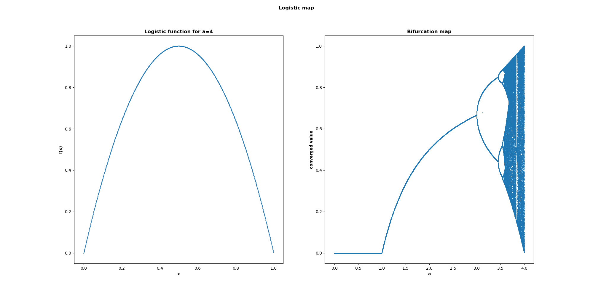
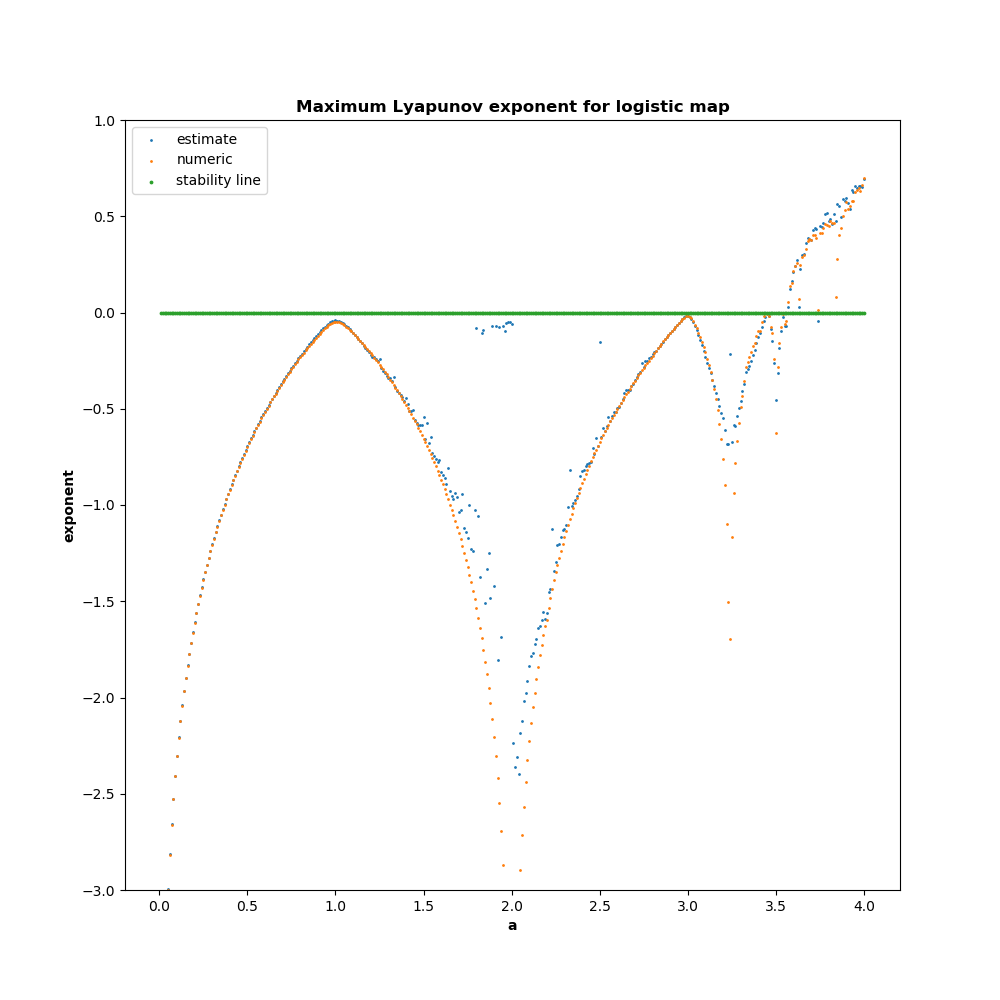

# ChaosComputing
This repository contains code and assets used to generate the [Computing With Chaos]() article. For context on what is here, check out the article!

# Contents
## Analysis
This folder contains python scripts used to generate the plots for the article and perform some mathematical analysis. The current contents are:

* **GenerateBifurcationMap.py**: This script generates a bifurcation map for a given chaotic function. It also plots the function for a selected parameter value. It was used to generate plots like this:

* **PlotLyapunovExponents.py**: This script computes the Lyapunov exponents for a given chaotic function both by direct curve-fitting and via the derivative trick. This can be used to determine under what parameter values a function is chaotic. It was used to generate plots like this:

* **SearchForLogicGateThresholds.py**: This script performs a brute-force search for chaotic parameters for a given chaotic function. It allows the user to specify the number of bits of precision to use for internal computation values, and enumerates through all possible values. This was used to find the chaotic parameter values referenced in the article. 
* 
## VHDL
This folder contains the VHDL project used to implement the chaotic lattice on the FPGA. It consists of the following important files:

* **universal_computer.vhd**: The top-level entity to be synthesized. Contains the routing logic for the chaotic lattice.
* **tent_universal_element.vhd**: The implementation for the chaotic logic gate. 
* **brute_force_universal_element.vhd**: A dummy universal logic gate used to validate the functionality of the chaotic lattice. 
* **universal_gate_testbench.vhd**: A testbench used to generate the functional simulations referenced in the article. 